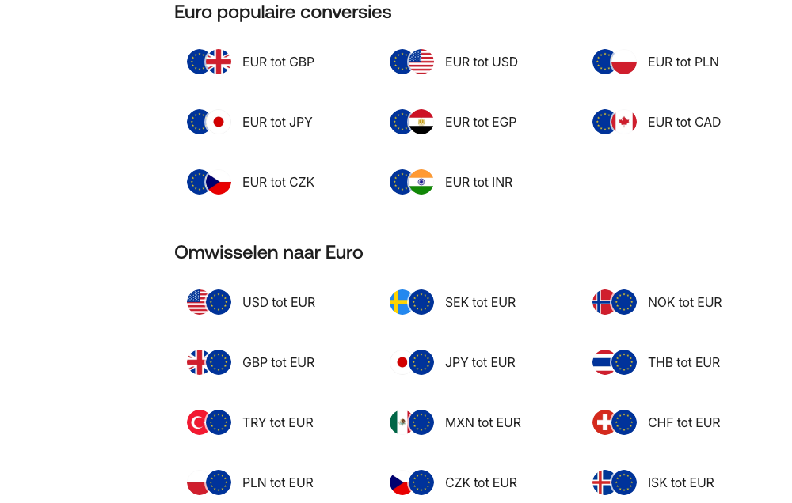

# Conversion Rate Grid

**Used on:** Currency Converter (6 occurrences — every sampled currency-converter page)

A large table/grid of live conversion rates for common amounts ("1 AED," "5 AED," "10 AED" ... up to "50,000 AED," each with its EUR equivalent), plus a "populaire conversies" section of related currency-pair shortcuts with flag icons. The most data-dense component in the sample (52 images, 26 links on the AED page alone) — clearly rendered from a live rates API rather than static content.
