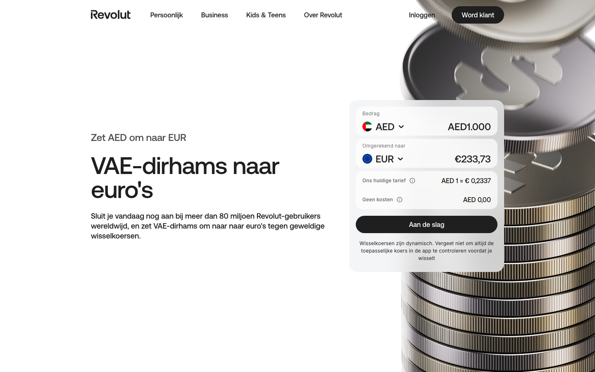

# Converter Widget

**Used on:** Currency Converter, Money Transfer Country Page (7 occurrences)

The hero-positioned interactive widget — the only component in this sample containing a real `<form>`. On [Currency Converter](../pages/currency-converter.md) pages it's a two-field amount/currency converter ("AED → EUR"); on [Money Transfer](../pages/money-transfer-country.md) it's the equivalent send-money form with a destination-country globe graphic. Functionally the core conversion tool of the page, repositioned/restyled slightly per template but structurally the same interactive block.
