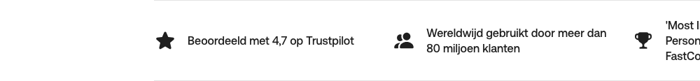

# Empty List Placeholder

**Used on:** Account Landing Page (1 occurrence, directly under the hero)

An empty `<ul>` with no children at all — likely a client-side-rendered badge, logo, or rating row (e.g. "As featured in..." or partner logos) that hadn't populated by the time the page was captured, rather than an intentionally empty element. Worth a second capture to confirm what it should contain.
