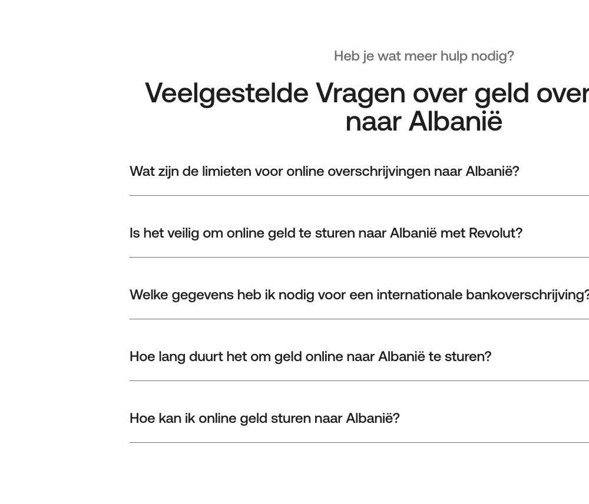

# FAQ Accordion

**Used on:** Money Transfer Country Page, eSIM Plan Page, Card Product: Virtual Card (4 occurrences)

A collapsed, expandable list of Q&A pairs (visually confirmed on the Money Transfer page: chevron-icon rows that expand on click) — "Veelgestelde Vragen over geld overschrijven naar Albanië," "Veelgestelde vragen over Afrika eSIM-plannen," "Veelgestelde Vragen over de virtuele debetkaart." The genuinely reusable FAQ pattern on the site, distinct from the [Short Text/CTA Block](short-text-cta-block.md)/[Text + Image Detail Block](text-image-detail-block.md), which present one FAQ answer already-expanded with a photo, rather than a collapsed multi-item list.

This was the component that initially split into 3 separate singleton entries before a fingerprint-bucketing fix (image/link counts were too finely bucketed, splitting instances that only differed in how many links happened to appear in that page's answer text) — see the note in the [overview](../index.md).
