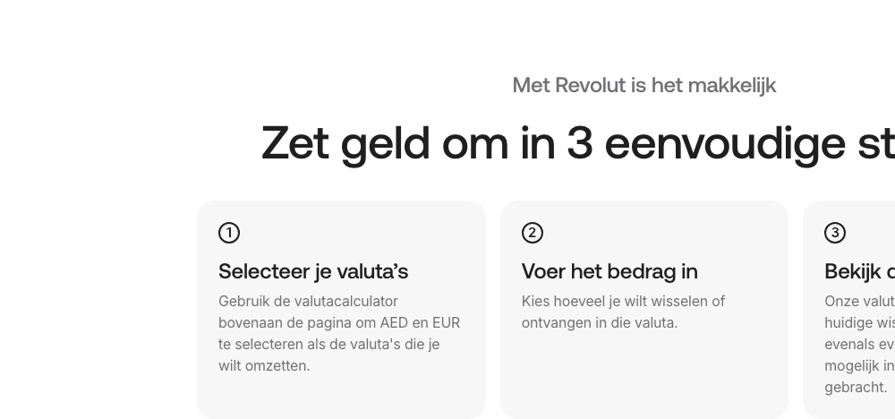

# Icon Grid Section

**Used on:** Currency Converter, Money Transfer Country Page, Account Landing Page (15 occurrences)

A heading-only section wrapper (no image, no direct links, several nested headings) that introduces a grid of icon+text cards beneath it — most often a "3 easy steps" explainer ("Zet geld om in 3 eenvoudige stappen," "Stuur geld naar Albanië in 3 stappen"), but also used for a plain section intro like "Bankoverschrijvingen" or the 8-tile feature grid intro "Alles wat je nodig hebt, op één plek" on the Account Landing Page.

## Variants observed

The "3 steps" numbered-icon variant is the dominant use (appears on both Currency Converter and Money Transfer), but the same block type also introduces larger, non-numbered feature grids — the shared trait is "heading + a grid of icon cards," not specifically "3 steps."
