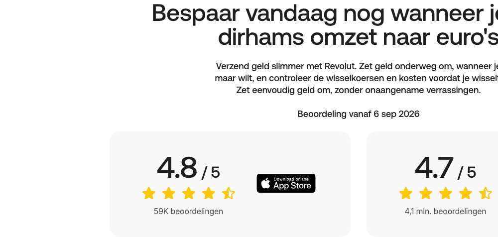

# Photo + Trust Badge Promo

**Used on:** Currency Converter, Money Transfer Country Page, eSIM Plan Page (8 occurrences)

A promo block combining a background photo/media element with App Store/Google Play rating badges or similar trust signals ("4.8/5 op App Store," "4.7/5 op Google Play") — reinforcing credibility right after or before a conversion-focused CTA. Headings vary by page ("Bespaar vandaag nog wanneer je VAE-dirhams omzet naar euro's," "Voer snel en moeiteloos overschrijvingen naar Albanië uit met de Revolut-app," "Sluit je aan bij meer dan 80 miljoen klanten wereldwijd") but the trust-badge pairing is consistent.
