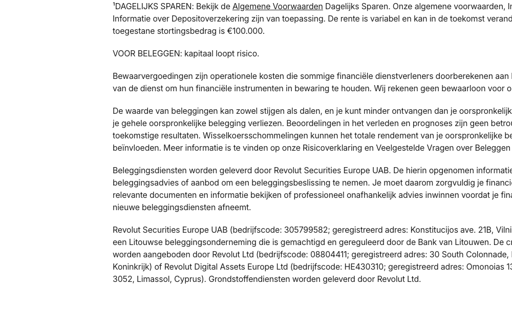

# Plain Section Divider

**Used on:** Account Landing Page, Homepage (default/international) (2 occurrences)

An untitled closing section with no heading — just a handful of links, no supporting image or text. Appears at the very end of `<main>` on both pages it's used on, right before the [Site Footer](site-footer.md), suggesting it's a final "quick links" or transitional block rather than genuine page content.
