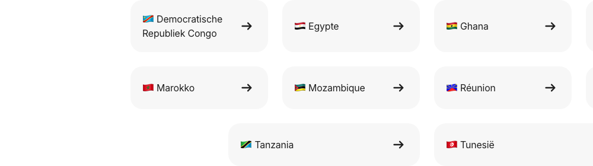

# Region Selector Block

**Used on:** eSIM Plan Page (1 occurrence, untitled)

A country/region dropdown selector for finding an eSIM plan by destination — one of the largest single blocks in the sample by element count (51–150 descendant elements), reflecting a full country list.
