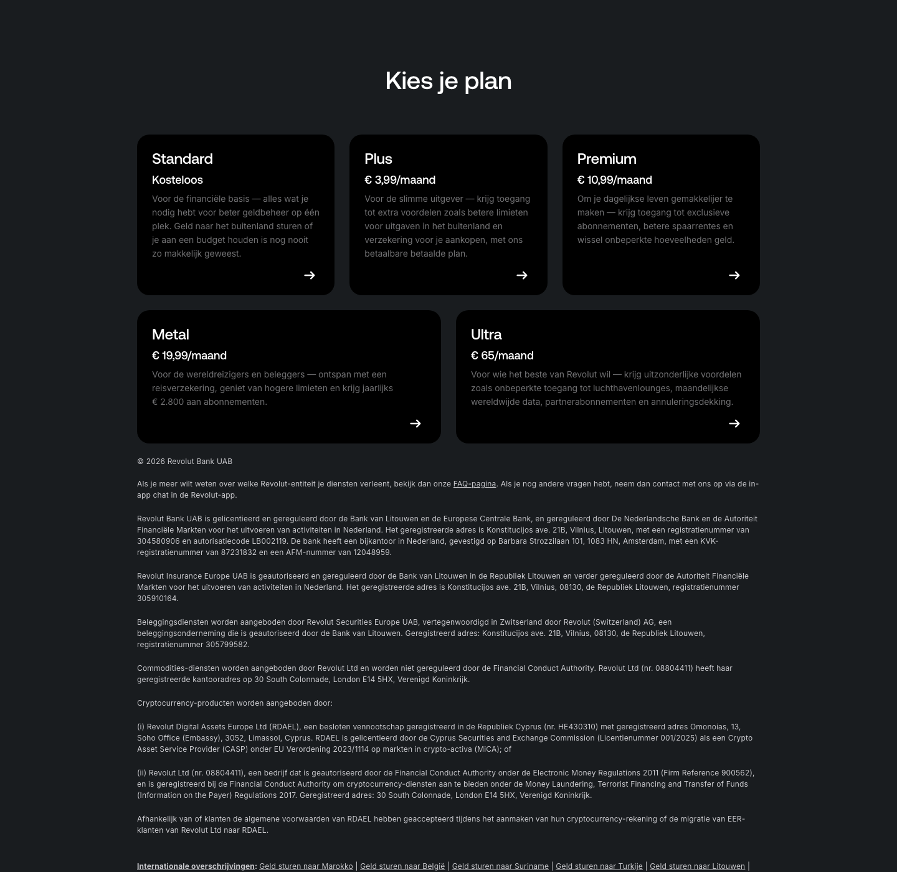

# Site Footer

**Used on:** every marketing page in this sample (17 occurrences)

Includes the pricing plan grid ("Kies je plan" / "Choose your plan" — Standard, Plus, Premium, Metal, Ultra) followed by extensive legal/regulatory disclosure text (Revolut's banking license details across multiple EU jurisdictions) and a standard link footer. On the [Business Landing Page](../pages/business-landing.md), the same component appears headed "Bankieren" instead of "Kies je plan" — likely a business-specific pricing variant rather than a different component.
