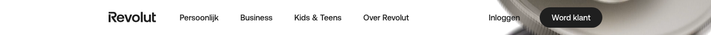

# Site Header

**Used on:** every marketing page in this sample (17 occurrences) — [Currency Converter](../pages/currency-converter.md), [Money Transfer](../pages/money-transfer-country.md), [Account Landing](../pages/account-landing.md), [Business Landing](../pages/business-landing.md), both [Homepages](../pages/homepage-nl.md), [eSIM](../pages/esim-plan.md), [Cards Hub](../pages/cards-hub.md) and all three card product pages

The shared marketing-site navigation: logo, primary nav links (Personlijk, Business, Kids & Teens, Over Revolut), language switcher, login, and a filled "Word klant" (Become a customer) CTA button. Present on every page in this sample except the two [Legal Terms](../pages/legal-terms.md)/[QR download](../pages/app-download-qr.md) pages, which use the stripped-down [Legal Page Header](legal-page-header.md) instead.
