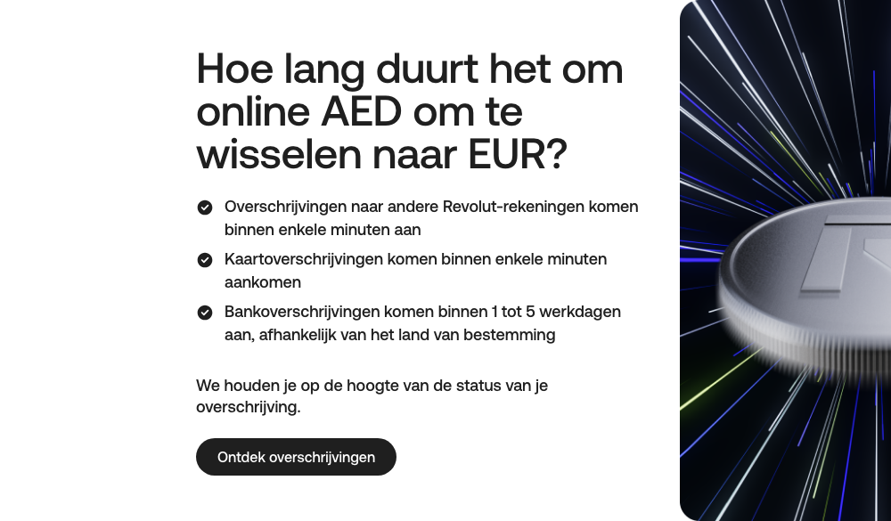

# Text + Image Detail Block

**Used on:** Currency Converter, Account Landing Page, Card Product: Virtual Card (10 occurrences)

A medium-sized block pairing one image with a heading and explanatory copy — used for FAQ-style detail answers ("Hoe lang duurt het om online AED om te wisselen naar EUR?") as well as feature explanations ("Je lokale rekening," "Houd je geld in de gaten," "Wat is een virtuele kaart?," "Al je virtuele kaarten online"). Larger and more detailed than the [Short Text/CTA Block](short-text-cta-block.md), but serving a similar dual role (FAQ answer or feature explainer) with the same visual shape.
