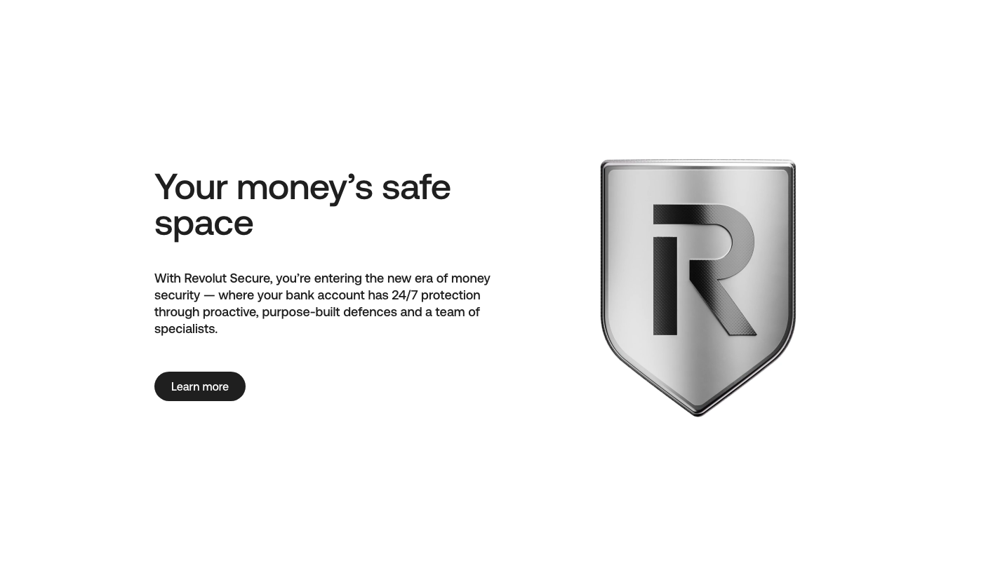

# Text + Media Intro Block

**Used on:** both Homepages, eSIM Plan Page, Card Product: Virtual Card (4 occurrences)

A text-led block with one supporting media element, used in two roles: as a **security/trust callout** on the homepages ("Your money's safe space" / "Een veilige plek voor je geld") and as a **page-opening hero** on the eSIM and Virtual Card product pages ("Afrika eSIM-plannen," "Virtuele kaart"). The crop above shows the homepage instance; the hero use looks different in practice (see [eSIM Plan](../pages/esim-plan.md)) despite sharing the same structural fingerprint.
