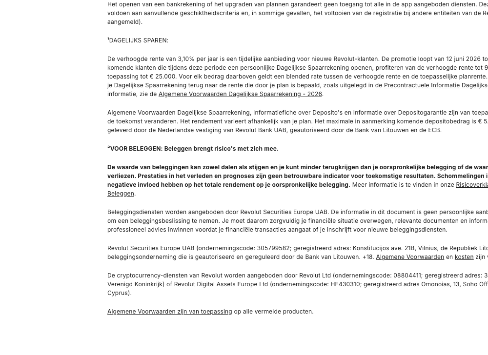

# Untitled Link Section

**Used on:** Homepage (NL), eSIM Plan Page (2 occurrences)

An untitled section holding a handful of links with no heading and no image — similar in shape to [Plain Section Divider](plain-section-divider.md) but slightly larger. On the NL homepage it's the closing links section before the footer; on the eSIM page it's the "Bekijk andere regionale data-abonnementen" cross-link block, listing sibling region pages.
