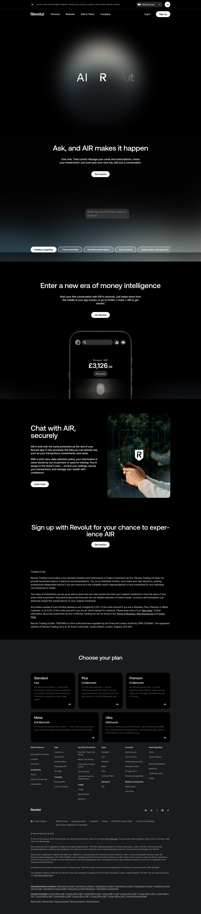

# AIR by Revolut Page

**URL:** `/air-ai-by-revolut` (page title: "AIR | AI by Revolut | Revolut GB") · **Occurrences:** 1 page in this run

Product page for AIR, Revolut's in-app AI assistant. Opens on a dark, glow-lit brand intro before explaining what the assistant does, how it's secured, and how to sign up.

## Section outline (top to bottom)

1. **[Site Header / Navigation](../components/site-header-navigation.md)**
2. **[Full-Bleed AI Assistant Intro](../components/full-bleed-ai-assistant-intro.md)**: full-screen "AIR" wordmark over a glowing dark background.
3. **[Alternating Image and Copy Sequence](../components/alternating-image-and-copy-sequence.md)**: "Ask, and AIR makes it happen", example prompt bubbles ("What was my total food spend in Greece?") and suggestion chips (Holiday budgeting, Travel essentials, Portfolio performance, Card controls, Subscription management).
4. **[Product Page Intro Banner](../components/product-page-intro-banner.md)**: "Enter a new era of money intelligence", with a phone mockup showing the AIR chat interface.
5. **[Feature Promo Block](../components/feature-promo-block.md)**: "Chat with AIR, securely", on the assistant's zero-data-retention policy.
6. **[Centered Heading CTA Banner](../components/centered-heading-cta-banner.md)**: "Sign up with Revolut for your chance to experience AIR".
7. **[Disclaimer Block with Linked Terms](../components/disclaimer-block-with-linked-terms.md)**: investment risk disclosure text.
8. **[Site Footer](../components/site-footer.md)**

## Content pattern

The page leads with brand atmosphere (the glowing "AIR" intro) before any product explanation, then alternates between example use cases and reassurance (security, data handling) before the sign-up push. Distinct from most other product pages here in leaning on mood and visual tone rather than a feature list.
