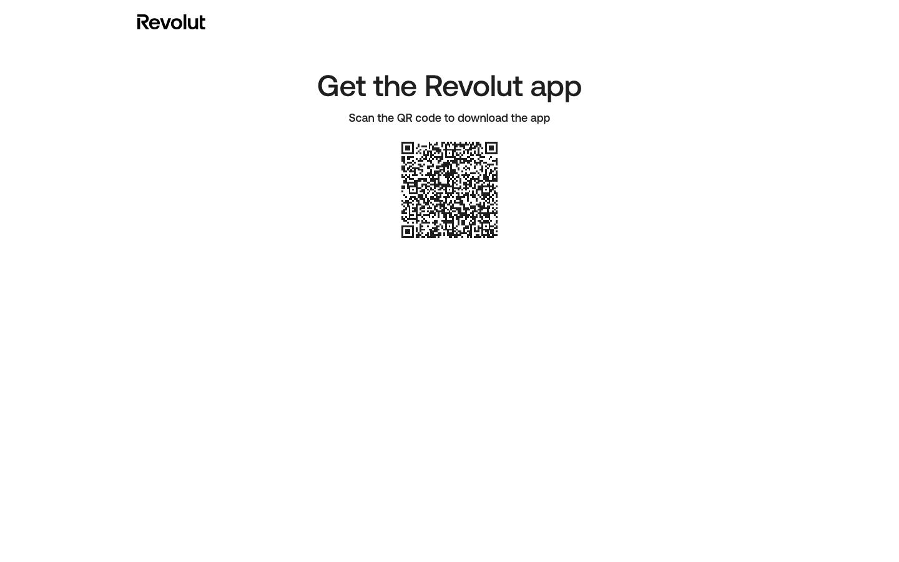

# App Download (QR)

**URL:** `revolut.com/get-revolut-under-18` (no locale prefix — a default/international utility page, likely linked from an email or offline flow) · **Occurrences:** 1

The simplest page in the entire sample: a logo, "Get the Revolut app" heading, one line of instruction, and a QR code. No nav, no footer, no marketing content — a single-purpose handoff page, presumably linked from a physical flyer, in-app prompt, or SMS rather than browsed to directly.

## Section outline (top to bottom)

- **[Legal Page Header](../components/legal-page-header.md)** — just the logo here, no nav or language switcher visible.
- **[QR Download Block](../components/qr-download-block.md)** — "Get the Revolut app" — heading, instruction text, QR code image. The entire page body.

## Content pattern

Shares its minimal header with the [Legal Terms Page](legal-terms.md) rather than the full marketing site header — a useful reminder that not every page follows the standard header/content/footer shape, and utility/handoff pages like this are worth capturing on their own rather than assuming they'll fit the dominant template.
