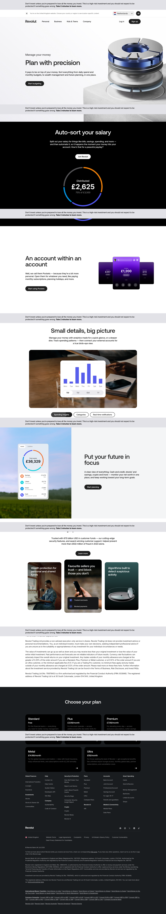

# Budget Planner

**URL:** `/best-budget-planner` (page title: "Budget Planner | Budgeting Analytics | Spending Tracker | Revolut United Kingdom") · **Occurrences:** 1 page in this run

A product page for Revolut's budgeting and analytics tools, covering salary auto-sorting, Pockets, spending analytics, and net worth tracking, plus an investment-risk disclaimer ahead of the plan comparison footer.

## Section outline (top to bottom)

1. **[Site Header / Navigation](../components/site-header-navigation.md)**
2. **[Product Page Intro Banner](../components/product-page-intro-banner.md)**: "Plan with precision".
3. **[Product Page Intro Banner](../components/product-page-intro-banner.md)**: "Auto-sort your salary", with a "Distributed £2,625" progress ring.
4. **[Feature Promo Block](../components/feature-promo-block.md)**: "An account within an account", introducing Pockets.
5. **[Tabbed Image Feature](../components/tabbed-image-feature.md)**: "Small details, big picture", a spending bar chart.
6. **[Feature Promo Block](../components/feature-promo-block.md)**: "Put your future in focus", net worth across "cash and credit, stocks and savings, crypto and more".
7. **[Feature Card Row](../components/feature-card-row.md)**: "Your money, protected from fraud", citing "67.5 billion USD in customer funds".
8. **[Trust Indicator & Disclaimer Strip](../components/trust-indicator-disclaimer-strip.md)**: stock trading risk disclaimer ("Capital at risk").
9. **[Site Footer](../components/site-footer.md)**

## Content pattern

Each feature section pairs one budgeting capability with a screenshot of the relevant app view (progress ring, Pockets cards, bar chart, net worth ring), building from everyday spending up to long-term net worth before the trust and legal sections. This is the only template in this batch that carries a standalone legal disclaimer block before the footer, tied to the stock-trading mention in the "Put your future in focus" section.
