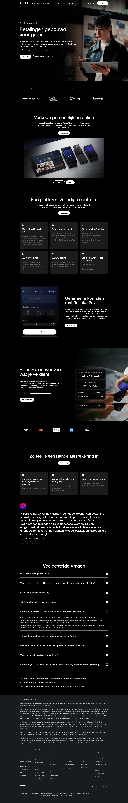

# Business Landing Page

**URL:** `/nl-NL/business/accept-payments` · **Occurrences:** 2 (`business/accept-payments`, `business`)

Notably different from every other template in this sample: `<main>` contains only **one** direct child — a single large wrapper div holding the entire page (hero, feature sections, pricing, everything). This is the same "one big wrapper" pattern seen on Rijksmuseum's homepage, and it means the analyzer's per-section outline can't break this page down the way it does the others — the wrapper itself is the only entry.

## What's actually on the page

Reviewed directly from the screenshot rather than the outline (which only sees the one wrapper): a hero ("Betalingen gebouwd voor groei" — accept payments online and in person), followed by feature sections on payment methods, business banking tools, and integrations, then the shared pricing/footer block.

## Section outline (top to bottom)

1. **[Site Header](../components/site-header.md)**
2. **[Business Hero Block](../components/business-hero-block.md)** — the single wrapper containing the whole page body.
3. **[Site Footer](../components/site-footer.md)** — labeled "Bankieren" here rather than "Kies je plan," suggesting the business footer variant may differ slightly from the consumer one.

## Content pattern

Worth a follow-up note for `analyze.ts`: pages using this "one big wrapper" pattern need the outline extraction to recurse one level deeper to be useful — same limitation flagged earlier on Rijksmuseum's homepage.
