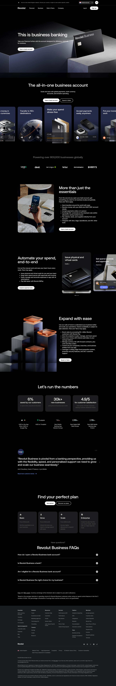

# Business Account Page

**URL:** `/business` (page title: "Business Account | Manage Your Finances | Revolut Business") · **Occurrences:** 2 pages in this run (also used on: revolut-plus)

The main product page for Revolut Business. It opens on the business banking pitch and runs through the account's spend, payment, and growth features, trust signals, and pricing before the FAQ and footer.

## Section outline (top to bottom)

1. **[Site Header / Navigation](../components/site-header-navigation.md)**
2. **[Product Page Intro Banner](../components/product-page-intro-banner.md)**: "This is business banking", "Take your finances further with the account designed for efficiency, and built for business."
3. **[Feature Card Row](../components/feature-card-row.md)**: "The all-in-one business account", a row of feature cards covering payments, cards, and integrations.
4. **[Freestanding Section Heading](../components/freestanding-section-heading.md)**
5. **[Award and Trust Badge Row](../components/award-and-trust-badge-row.md)**
6. **[Feature Promo Block](../components/feature-promo-block.md)**: "More than just the essentials", a supporting feature pitch.
7. **[Feature Card Row](../components/feature-card-row.md)**: "Automate your spend, end-to-end", a second row of feature cards.
8. **[Feature Promo Block](../components/feature-promo-block.md)**: "Expand with ease", on scaling the account internationally.
9. **[Section Intro](../components/section-intro.md)**: "Let's run the numbers", introducing the stats block that follows.
10. **[Text Feature List](../components/text-feature-list.md)**: "6%", a list of business statistics/metrics.
11. **[Award and Trust Badge Row](../components/award-and-trust-badge-row.md)**
12. **[Disclaimer Block with Linked Terms](../components/disclaimer-block-with-linked-terms.md)**
13. **[Centered Heading CTA Banner](../components/centered-heading-cta-banner.md)**: "Find your perfect plan", pointing into the plan comparison.
14. **[Trust Indicator & Disclaimer Strip](../components/trust-indicator-disclaimer-strip.md)**
15. **[FAQ Accordion](../components/faq-accordion.md)**: "Revolut Business FAQs", questions on opening and managing a business account.
16. **[Disclaimer Block with Linked Terms](../components/disclaimer-block-with-linked-terms.md)**
17. **[Trust Indicator & Disclaimer Strip](../components/trust-indicator-disclaimer-strip.md)**
18. **[Site Footer](../components/site-footer.md)**

## Content pattern

The page works as a long scrolling pitch: an opening hero, then alternating feature blocks and trust signals (badges, stats, disclaimers), building toward a plan comparison and FAQ before the footer. Several disclaimer and trust-badge blocks repeat because each pricing/legal claim on the page gets its own adjacent disclaimer, not because the page reuses one block twice for the same content.
