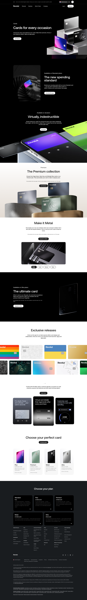

# Cards

**URL:** `/cards` (page title: "Cards | Revolut United Kingdom") · **Occurrences:** 1 page in this run

A product page for Revolut's physical and virtual card lineup. It runs through card tiers, from the standard card up to the metal Ultra card, plus a gallery of special-edition designs.

## Section outline (top to bottom)

1. **[Site Header / Navigation](../components/site-header-navigation.md)**
2. **[Alternating Image and Copy Sequence](../components/alternating-image-and-copy-sequence.md)**: "Cards for every occasion", on choosing colour and material.
3. **[Photo Feature Block](../components/photo-feature-block.md)**: "The Premium collection", Sage Green, Slate Grey, and Midnight Blue cards.
4. **[Product Page Intro Banner](../components/product-page-intro-banner.md)**: "The ultimate card", the platinum Ultra plan card.
5. **[Full-Bleed Centered Promo Panel](../components/full-bleed-centered-promo-panel.md)**: "Exclusive releases", a gallery of special-edition card designs.
6. **[Site Footer](../components/site-footer.md)**

## Content pattern

The page steps up through card tiers in order of exclusivity, standard, then Premium, then Ultra, closing with the special-edition gallery as a lighter, browsable finish before the plan-comparison footer.

## Variants observed

The outline data covers far fewer sections than the screenshot shows. Between the intro hero and the Premium collection panel, the live page has two more sections not represented in the outline ("The new spending standard" and "Virtually, indestructible"). Between the Premium collection and the video banner there's a "Make it Metal" section. And between the special-edition gallery and the footer there's a trust/security feature row ("Trusted with £75 billion USD...") plus a "Choose your perfect card" comparison strip. None of these appear as outline blocks, so this page has noticeably more content than the six-item outline above reflects.
