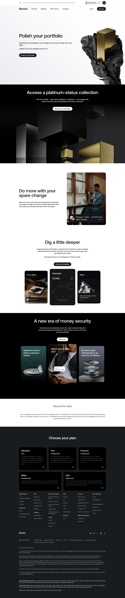

# Commodities Trading Product Page

**URL:** `/commodities-trading` (page title: "How to Invest in Commodities | Invest in Gold, Silver & More | Revolut United Kingdom") · **Occurrences:** 1 page in this run

Product page for trading precious metals (gold, silver, palladium, platinum) in the Revolut app. It covers the roundup feature for buying metals with spare change, in-app price tools, and closes with a risk disclaimer specific to commodities.

## Section outline (top to bottom)

1. **[Site Header / Navigation](../components/site-header-navigation.md)**
2. **[Product Page Intro Banner](../components/product-page-intro-banner.md)**: "Polish your portfolio", the precious metals pitch.
3. **[Feature Promo Block](../components/feature-promo-block.md)**: "Access a platinum-status collection", choosing between gold, silver, palladium, and platinum.
4. **[Image & Caption Block](../components/image-caption-block.md)**: "Do more with your spare change", roundups converted to metals automatically.
5. **[Feature Card Row](../components/feature-card-row.md)**: "Dig a little deeper", price alerts, forecasts, and news cards.
6. **[Feature Card Row](../components/feature-card-row.md)**: "A new era of money security", fraud detection, support, and biometric withdrawal cards.
7. **[Freestanding Section Heading](../components/freestanding-section-heading.md)**: "About the risks".
8. **[Trust Indicator & Disclaimer Strip](../components/trust-indicator-disclaimer-strip.md)**: commodities-specific risk text, noting the service isn't FCA-regulated.
9. **[Site Footer](../components/site-footer.md)**

## Content pattern

Structurally close to the Stock Trading page (hero, feature panel, highlight row, trust section) but shorter, with a plain heading plus disclaimer pair standing in for the fuller Investment Risk Disclaimer block used on the regulated stock and ISA pages. That's consistent with the copy's own note that commodities services aren't FCA-regulated.
