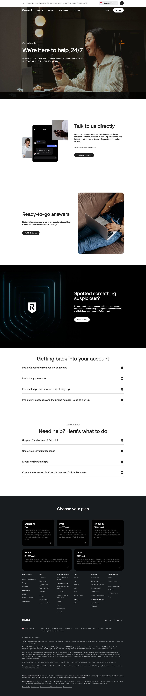

# Contact Us Page

**URL:** `/contact-us` (page title: "How Do I Contact Revolut Customer Support | Revolut Email, Phone Number | Revolut United Kingdom") · **Occurrences:** 1 page in this run

A support hub page that routes visitors to in-app chat, the Help Centre, fraud reporting, and account-recovery steps rather than listing an email address or phone number directly.

## Section outline (top to bottom)

1. **[Site Header / Navigation](../components/site-header-navigation.md)**
2. **[Image & Caption Block](../components/image-caption-block.md)**: "We're here to help, 24/7" over a photo of someone on their phone.
3. **[Feature Promo Block](../components/feature-promo-block.md)**: "Talk to us directly", in-app chat in 100+ languages, "Visit the in-app chat".
4. **[Feature Promo Block](../components/feature-promo-block.md)**: "Ready-to-go answers", links to the Help Centre.
5. **[Feature Promo Block](../components/feature-promo-block.md)**: "Spotted something suspicious?", fraud reporting prompt with a "Report activity" link.
6. **[FAQ Accordion](../components/faq-accordion.md)**: "Getting back into your account", four expandable items starting with "I've lost access to my account or my card".
7. **[FAQ Accordion](../components/faq-accordion.md)**: "Need help? Here's what to do", quick-access items including "Suspect fraud or scam? Report it".
8. **[Site Footer](../components/site-footer.md)**

## Content pattern

The page sorts help paths by urgency: general support and self-service first, security (fraud reporting) in the middle as its own dark-background block, then account-recovery and quick-access lists at the bottom for people who already know what they need.
