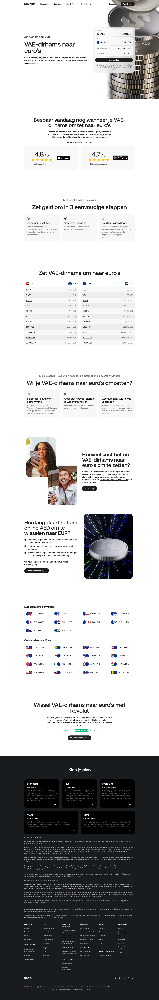

# Currency Converter

**Representative URL:** `/nl-NL/currency-converter/convert-aed-to-eur-exchange-rate` · **Occurrences:** 6 of 6 sampled currency pairs in this run (AED, NOK, SEK, CZK, DKK, CHF → EUR) — one of the largest repeating patterns on the site, likely covering dozens of currency-pair combinations site-wide.

An SEO-driven programmatic template: same layout for every currency pair, with the specific currencies, rates, and copy swapped in.

## Section outline (top to bottom)

- **[Site Header](../components/site-header.md)**
- **[Converter Widget](../components/converter-widget.md)** — "VAE-dirhams naar euro's"
- **[Photo + Trust Badge Promo](../components/photo-trust-promo-block.md)** — "Bespaar vandaag nog wanneer je VAE-dirhams omzet naar euro's"
- **[Icon Grid Section](../components/icon-grid-intro.md)** — "Zet geld om in 3 eenvoudige stappen"
- **[Photo + Copy CTA Block](../components/photo-copy-cta-block.md)** — "Zet VAE-dirhams om naar euro's"
- **[Icon Grid Section](../components/icon-grid-intro.md)** — "Wil je VAE-dirhams naar euro's omzetten?"
- **[Short Text/CTA Block](../components/short-text-cta-block.md)** — "Hoeveel kost het om VAE-dirhams naar euro's om te zetten?"
- **[Text + Image Detail Block](../components/text-image-detail-block.md)** — "Hoe lang duurt het om online AED om te wisselen naar EUR?"
- **[Conversion Rate Grid](../components/conversion-rate-grid.md)** — "Euro populaire conversies"
- **[Short Text/CTA Block](../components/short-text-cta-block.md)** — "Wissel VAE-dirhams naar euro's met Revolut"
- **[Site Footer](../components/site-footer.md)** — "Kies je plan"

## Content pattern

The clearest example of a true repeating template on the site: section sequence, block types, and even most of the copy structure are identical across all 6 sampled instances — only the currency name, symbol, rate figures, and a few numbers change. A strong candidate for a headless-CMS "currency pair" content type if this site were being migrated.
