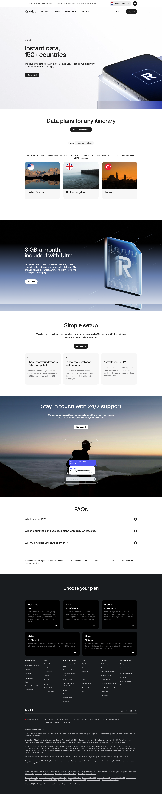

# eSIM Data Plans Page

**URL:** `/data-plans` (page title: "eSIM: What is an eSIM and how do I get one? | Revolut United Kingdom") · **Occurrences:** 1 page in this run

A product page for Revolut's eSIM travel data plans. It covers what an eSIM is, which countries are covered, how setup works, and answers common questions before the standard plan comparison footer.

## Section outline (top to bottom)

1. **[Site Header / Navigation](../components/site-header-navigation.md)**
2. **[Product Page Intro Banner](../components/product-page-intro-banner.md)**: "Instant data, 150+ countries" with the line "Easy to set up. Available in 150+ countries."
3. **[Centered Heading CTA Banner](../components/centered-heading-cta-banner.md)**: "Data plans for any itinerary" with a "View all destinations" link.
4. **[Category Tab Selector](../components/category-tab-selector.md)**: "Local", "Regional", "Global" tabs.
5. **[Trust Indicator & Disclaimer Strip](../components/trust-indicator-disclaimer-strip.md)**: pricing note, "top up from just £3.49 for 1 GB".
6. **[App Screenshot Feature Block](../components/app-screenshot-feature-block.md)**: destination cards for "United States", "United Kingdom", "Türkiye".
7. **[Feature Promo Block](../components/feature-promo-block.md)**: "3 GB a month, included with Ultra".
8. **[Feature List with Link](../components/feature-list-with-link.md)**: "Simple setup" in three numbered steps, "Check that your device is eSIM-compatible", "Follow the installation instructions", "Activate your eSIM".
9. **[Feature Promo Block](../components/feature-promo-block.md)**: "Stay in touch with 24/7 support" over a night sky photo with an in-app chat screenshot.
10. **[Text Feature List](../components/text-feature-list.md)**: "FAQs" list, starting with "What is an eSIM?".
11. **[Trust Indicator & Disclaimer Strip](../components/trust-indicator-disclaimer-strip.md)**: notes that Revolut Ltd acts as agent for 1GLOBAL, the eSIM plan provider.
12. **[Site Footer](../components/site-footer.md)**

## Content pattern

The page moves from persuasion to logistics to reassurance: sell the coverage and the Ultra-plan freebie first, then walk through setup in three steps, then close any doubts with support availability and an FAQ list. The dual legal disclaimers separate pricing caveats (mid-page) from the underlying-provider disclosure (end of page).

## Variants observed

The "FAQs" block (`main>10`) is mapped to the "Feature Summary Cards" component, but the screenshot shows a plain collapsible accordion list with plus/expand icons, matching the site's `faq-accordion` component elsewhere rather than a card layout. Flagging this since the outline data's componentTitle/componentSlug were used verbatim as instructed.
