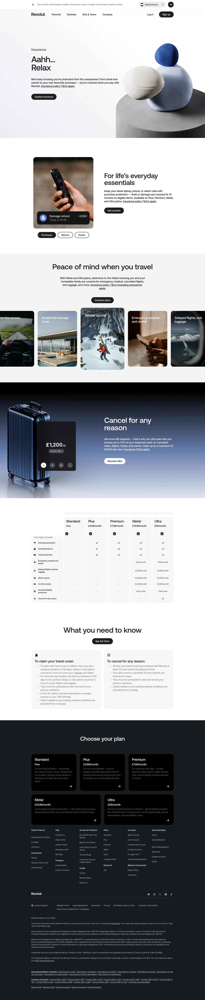

# Insurance Product Page

**URL:** `/global-insurance` (page title: "Insurance | Quotes and Claims | Revolut UK | Revolut United Kingdom") · **Occurrences:** 1 page in this run

Marketing and sales page for Revolut's insurance offering. It moves from a hero pitch through feature explainers for purchase and travel cover to a plan comparison table and claim conditions, ending on the standard plan picker.

## Section outline (top to bottom)

1. **[Site Header / Navigation](../components/site-header-navigation.md)**
2. **[Product Page Intro Banner](../components/product-page-intro-banner.md)**: "Aahh... Relax" headline over a photo of balanced stones, with an "Explore insurance" button and an "Insurance policy T&Cs apply" link.
3. **[Photo Feature Block](../components/photo-feature-block.md)**: "For life's everyday essentials" purchase protection pitch next to a phone screenshot showing a "Damage refund +£890" notification.
4. **[Feature Card Row](../components/feature-card-row.md)**: "Peace of mind when you travel" travel cover pitch with a "Compare plans" button above a row of five cards (car hire excess, accidental damage cover, winter sports, emergency medical and dental, delayed flights and lost luggage).
5. **[Product Page Intro Banner](../components/product-page-intro-banner.md)**: "Cancel for any reason" pitch for the Ultra plan's cancellation cover, next to an animated suitcase and a "£1,200.10" price readout, with a "Discover Ultra" button.
6. **[Plan and Provider Comparison Table](../components/plan-and-provider-comparison-table.md)**: five plan columns (Standard, Plus, Premium, Metal, Ultra) checked against coverage rows including purchase protection, extended returns, ticket protection, and cancel for any reason.
7. **[Feature List with Link](../components/feature-list-with-link.md)**: "What you need to know" section, two cards covering travel cover claim conditions and cancel for any reason conditions, with a "See full T&Cs" link.
8. **[Site Footer](../components/site-footer.md)**

## Content pattern

The page works as a single funnel: hook with the hero, build the case with two feature sections aimed at different customer worries (everyday purchases, travel), remove price uncertainty with a full plan comparison table, then cover the fine print before handing off to the plan picker that closes almost every page on the site.
