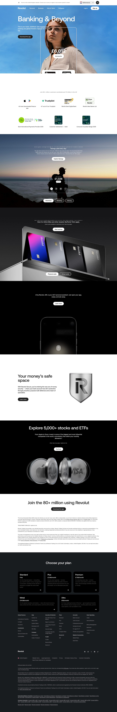

# Home Page

**URL:** `/` (page title: "Banking & Beyond | Revolut United Kingdom") · **Occurrences:** 1 page in this run

The main marketing homepage for Revolut UK. It introduces the core account and works through savings, cards, security, and investing before ending on a single sign-up push.

## Section outline (top to bottom)

1. **[Site Header / Navigation](../components/site-header-navigation.md)**
2. **[Photo Feature Block](../components/photo-feature-block.md)**: "Banking & Beyond" with the line "This is your bank, redefined. Get powerful daily banking and global freedom. Sign up for free in a tap."
3. **[Image & Caption Block](../components/image-caption-block.md)**: "Join 80+ million customers worldwide and 13 million in the UK", with proof points like "#3 most downloaded finance app" and "4.7 out of 5 on Trustpilot".
4. **[Award and Trust Badge Row](../components/award-and-trust-badge-row.md)**: three award badges, including "Best International Payments Provider 2025" and "Consumer Guardian Badge 2025".
5. **[Photo Feature Block](../components/photo-feature-block.md)**: "Life, meets savings", pitching up to 4% AER (variable) interest on Instant Access Savings.
6. **[Alternating Image and Copy Sequence](../components/alternating-image-and-copy-sequence.md)**: "Elevate your spend", on earning points redeemable for Airline Miles.
7. **[Product Page Intro Banner](../components/product-page-intro-banner.md)**: "Your money's safe space", introducing Revolut Secure and 24/7 account protection.
8. **[Product Page Intro Banner](../components/product-page-intro-banner.md)**: "Explore 5,000+ stocks and ETFs", a commission-free investing pitch.
9. **[Centered Heading CTA Banner](../components/centered-heading-cta-banner.md)**: "Join the 80+ million using Revolut" with a single "Download the app" link.
10. **[Disclaimer Block with Linked Terms](../components/disclaimer-block-with-linked-terms.md)**: AER and investment risk disclosures.
11. **[Site Footer](../components/site-footer.md)**

## Content pattern

The homepage works as a scrolling tour of Revolut's product line. Each section hands off to the next product (current account, savings, cards, security, investing), each with its own heading and CTA. Trust signals (customer counts, awards, ratings) appear early and again near the bottom, right before the plan comparison and footer close the page.
