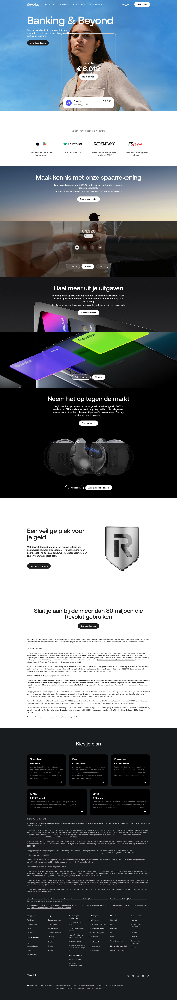

# Homepage (NL)

**URL:** `/nl-NL` (page title: "Revolut | De all-in-one financiële app voor je geld") · **Occurrences:** 1

The Dutch-localized homepage — structurally the same template as [Homepage (default/international)](homepage-default.md), with Dutch copy and NL-specific stats and promo content.

## Section outline (top to bottom)

- **[Site Header](../components/site-header.md)**
- **[Hero Section (image-led)](../components/hero-section-image-led.md)** — "Banking & Beyond" (headline kept in English even here; supporting copy is Dutch)
- **[Stat/Trust Callout](../components/stat-trust-callout.md)** — "De bank van 1 miljoen in in Nederland"
- **[Image Carousel Promo](../components/image-carousel-promo.md)** — "Maak kennis met onze spaarrekening" (savings account, mountain/sunset imagery)
- **[Market Investing Callout](../components/market-investing-callout.md)** — "Neem het op tegen de markt" (stock/ETF investing)
- **[Text + Media Intro Block](../components/text-media-intro-block.md)** — "Een veilige plek voor je geld"
- **[Small Centered CTA](../components/small-centered-cta.md)** — "Sluit je aan bij de meer dan 80 miljoen die Revolut gebruiken"
- **[Untitled Link Section](../components/untitled-link-section.md)** — closing links section
- **[Site Footer](../components/site-footer.md)** — "Kies je plan"

## Content pattern

See [Homepage (default/international)](homepage-default.md) for the shared structural notes — the two are close enough that they could reasonably be treated as one template with a locale-swapped content variant, but each was only captured once in this sample so they weren't clustered together.
