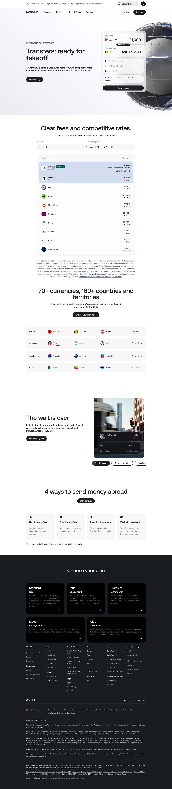

# International Transfers Page

**URL:** `/international-transfers` (page title: "International Transfers | Revolut United Kingdom") · **Occurrences:** 1 page in this run

A product landing page for Revolut's international money transfer service. It combines a rate calculator, a fee comparison against competitors, and a country coverage list to make the case for using Revolut over other providers.

## Section outline (top to bottom)

1. **[Site Header / Navigation](../components/site-header-navigation.md)**
2. **[Transfer Quote Hero](../components/transfer-quote-hero.md)**: "Transfers: ready for takeoff" with a live send widget (GBP to PLN) and the line "competitive rates when sending to 160+ countries & territories".
3. **[Provider Rate Comparison Calculator](../components/provider-rate-comparison-calculator.md)**: "Clear fees and competitive rates." comparing Revolut's total cost against Remitly, Wise, MoneyGram, NatWest, Xoom, Lloyds, HSBC, and Nationwide for the same GBP to PLN transfer.
4. **[Centered Heading CTA Banner](../components/centered-heading-cta-banner.md)**: "70+ currencies, 160+ countries and territories" with a "Choose your currencies" link.
5. **[Photo Feature Block](../components/photo-feature-block.md)**: full country list grouped by region, starting with Europe.
6. **[Photo Feature Block](../components/photo-feature-block.md)**: "The wait is over", a transfer notification screenshot showing a completed payment "To Sarah L".
7. **[Centered Heading CTA Banner](../components/centered-heading-cta-banner.md)**: "4 ways to send money abroad" with a "Start sending" link.
8. **[Text Feature List](../components/text-feature-list.md)**: "Bank transfers", "Card transfers", "Revolut transfers", and "Wallet transfers" methods.
9. **[Trust Indicator & Disclaimer Strip](../components/trust-indicator-disclaimer-strip.md)**
10. **[Disclaimer Block with Linked Terms](../components/disclaimer-block-with-linked-terms.md)**: footnote on exchange, transfer fees, and fair usage limits.
11. **[Site Footer](../components/site-footer.md)**

## Content pattern

The page builds its case for Revolut in a fixed order: show the live rate and fee against named competitors first, then prove reach with the full country list, then reassure on speed with a real transfer screenshot, then close with the practical "how to send" methods. Legal disclaimers sit directly under the claims they qualify rather than being pushed to the very bottom.
