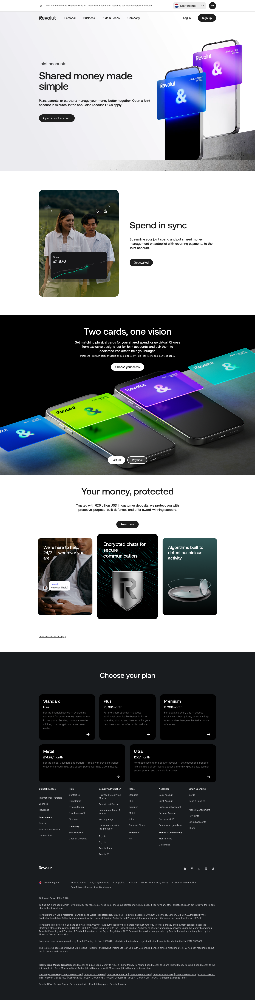

# Joint Accounts Page

**URL:** `/joint-accounts` (page title: "Joint accounts | Revolut United Kingdom") · **Occurrences:** 1 page in this run

The product page for Revolut's Joint account. A short, focused page: hero, two supporting feature sections, a security block, and the shared footer.

## Section outline (top to bottom)

1. **[Site Header / Navigation](../components/site-header-navigation.md)**
2. **[Product Page Intro Banner](../components/product-page-intro-banner.md)**: "Shared money made simple", eyebrow "Joint accounts", with a "Open a Joint account" button.
3. **[Feature Promo Block](../components/feature-promo-block.md)**: "Spend in sync", on recurring payments into the Joint account.
4. **[Photo Feature Block](../components/photo-feature-block.md)**: "Two cards, one vision", on matching physical or virtual cards for the account.
5. **[Feature Card Row](../components/feature-card-row.md)**: "Your money, protected", citing "67.5 billion USD in customer deposits".
6. **[Disclaimer Block with Linked Terms](../components/disclaimer-block-with-linked-terms.md)**: "Joint Account T&Cs apply."
7. **[Site Footer](../components/site-footer.md)**

## Content pattern

This is a compact version of the same hero-plus-feature rhythm used across the account product pages, just with fewer sections than Bank Account or Savings. That fits a Joint account being a variant of the core current account rather than a distinct product line: one hero, two feature sections, one trust block, done.
