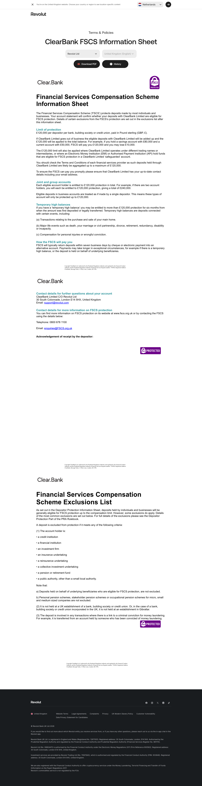

# ClearBank FSCS Information Sheet Page

**URL:** `/legal/clearbank-fscs-information-sheet` (page title: "ClearBank FSCS Information Sheet | Revolut United Kingdom") · **Occurrences:** 1 page in this run

A deposit-protection disclosure for ClearBank, the partner bank behind some Revolut accounts, published under the same stripped-down legal page template used across `/legal/*`.

## Section outline (top to bottom)

1. **[Site Header - Legal Pages](../components/site-header-legal-pages.md)**
2. **[Legal Document Viewer](../components/legal-document-viewer.md)**: "Terms & Policies" eyebrow, title "ClearBank FSCS Information Sheet", with a "Download PDF" button and version history.
3. **[FAQ Accordion](../components/faq-accordion.md)**: on this page the same structural fingerprint as the FAQ widget is used for the document's own body text, explaining the £120,000 FSCS deposit protection limit for ClearBank, alongside the Clear.Bank partner logo and a purple "PROTECTED" badge, not a real FAQ.
4. **[Legal Page Footer](../components/legal-page-footer.md)**

## Content pattern

Same single-document shell as the other legal pages, but built around a specific banking partner rather than a full contract or disclosure. The partner logo and protection badge carry more of the trust-building weight here than in the plain-text legal documents.
