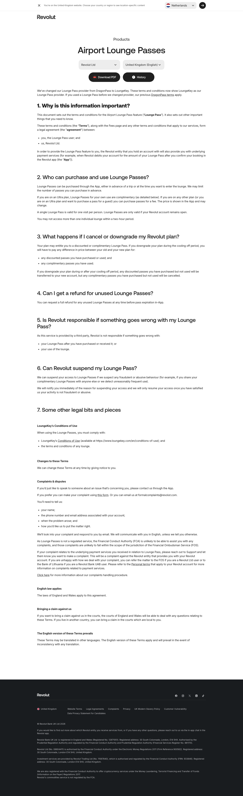

# Airport Lounge Passes Page

**URL:** `/legal/collinson-lounges` (page title: "Airport Lounge Passes | Revolut United Kingdom") · **Occurrences:** 1 page in this run

The terms and conditions for Revolut's airport Lounge Pass feature, published under the stripped-down legal page template used across `/legal/*`.

## Section outline (top to bottom)

1. **[Site Header - Legal Pages](../components/site-header-legal-pages.md)**
2. **[Legal Document Viewer](../components/legal-document-viewer.md)**: "Products" eyebrow, title "Airport Lounge Passes", with a "Download PDF" button and version history.
3. **[FAQ Accordion](../components/faq-accordion.md)**: on this page the same structural fingerprint as the FAQ widget is used for the document's own body text, terms split into seven numbered clauses from "1. Why is this information important?" to "7. Some other legal bits and pieces", noting the switch from DragonPass to LoungeKey as the lounge pass provider, not a real FAQ.
4. **[Legal Page Footer](../components/legal-page-footer.md)**

## Content pattern

Same shell as the other legal pages, header, one document body, footer, but this document reads as a feature-specific terms sheet rather than a regulatory disclosure. It's structured as a run of plain questions and answers ("Can I get a refund for unused Lounge Passes?") instead of formal numbered clauses.
