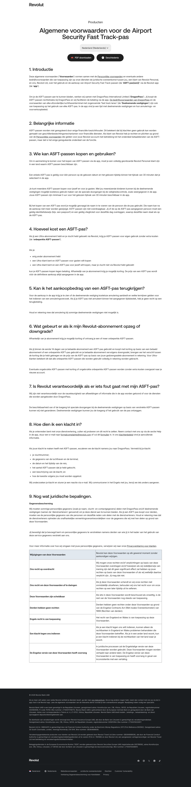

# Legal Terms Page

**URL:** `/nl-NL/legal/airport-fast-track-pass` · **Occurrences:** 2 (an `nl-NL` locale version and a locale-less default version)

A plain terms-and-conditions document — structurally the simplest marketing-adjacent template on the site, and the only one using a different, minimal header/footer pair instead of the shared site chrome.

## Section outline (top to bottom)

- **[Legal Page Header](../components/legal-page-header.md)** — a stripped-down header (just logo + language switcher, no nav links or ticket-style CTA).
- **[Legal Content Block](../components/legal-content-block.md)** — breadcrumb, title, language dropdown, PDF-download button, then 9 numbered sections of prose and a terms-definition table.
- **[Legal Page Footer](../components/legal-page-footer.md)** — minimal, legal-links-only footer (no pricing grid, no sponsor logos).

## Content pattern

The clearest structural outlier in the sample: no marketing content, no pricing plans, and a different header/footer pair from every other page. Worth keeping as its own template rather than merging with anything else.
