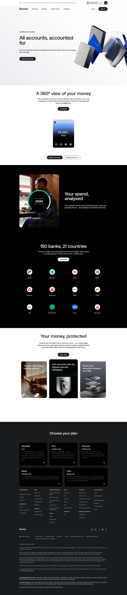

# Linked Accounts

**URL:** `/linked-accounts` (page title: "Link Bank Accounts in One App | Open Banking | Revolut United Kingdom") · **Occurrences:** 1 page in this run

A product page for Revolut's open banking feature, letting a user view and analyse external bank accounts inside the Revolut app. It moves from the single-view pitch through spend analytics, a bank-logo grid showing coverage, and a security section.

## Section outline (top to bottom)

1. **[Site Header / Navigation](../components/site-header-navigation.md)**
2. **[Product Page Intro Banner](../components/product-page-intro-banner.md)**: "All accounts, accounted for".
3. **[App Preview Feature Panel](../components/app-preview-feature-panel.md)**: "A 360° view of your money".
4. **[Photo Feature Block](../components/photo-feature-block.md)**: "Your spend, analysed", followed by "150 banks, 21 countries" and a grid of bank logos (Lloyds, Barclays, HSBC, and others).
5. **[Feature Card Row](../components/feature-card-row.md)**: "Your money, protected", citing "67.5 billion USD in customer funds".
6. **[Trust Indicator & Disclaimer Strip](../components/trust-indicator-disclaimer-strip.md)**
7. **[Site Footer](../components/site-footer.md)**

## Content pattern

The bank-logo grid inside the Feature Spotlight Section functions as proof of coverage, backing up the "150 banks, 21 countries" claim right where a visitor would question it. As in the Budget Planner template, a legal disclaimer sits between the last feature section and the footer.
