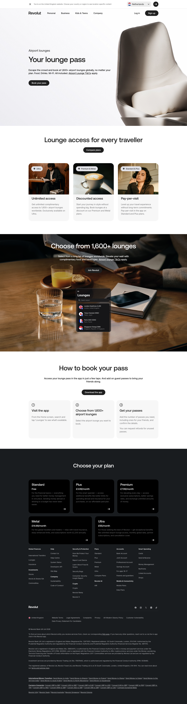

# Airport Lounges Page

**URL:** `/lounges` (page title: "Lounges | Revolut United Kingdom") · **Occurrences:** 1 page in this run

Product page for Revolut's airport lounge access perk. It explains who gets access at what tier, shows the booking flow inside the app, and closes on the plan picker.

## Section outline (top to bottom)

1. **[Site Header / Navigation](../components/site-header-navigation.md)**
2. **[Product Page Intro Banner](../components/product-page-intro-banner.md)**: "Your lounge pass" headline over a photo of a lounge chair, with a "Book your pass" button.
3. **[Centered Heading CTA Banner](../components/centered-heading-cta-banner.md)**: "Lounge access for every traveller" with a "Compare plans" button.
4. **[App Screenshot Feature Block](../components/app-screenshot-feature-block.md)**: three access tiers, "Unlimited access" (Ultra), "Discounted access" (Premium & Metal), and "Pay-per-visit" (Standard & Plus), each with its own photo.
5. **[Feature Promo Block](../components/feature-promo-block.md)**: "Choose from 1,600+ lounges" over a full-width photo with a lounge search app screenshot overlaid, and a "Join Revolut" button.
6. **[Feature List with Link](../components/feature-list-with-link.md)**: "How to book your pass" three numbered steps, "Visit the app", "Choose from 1,600+ airport lounges", "Get your passes".
7. **[Site Footer](../components/site-footer.md)**

## Content pattern

A short, focused product page: hero, tier breakdown, proof of scale (1,600+ lounges), then a how-it-works strip before the standard plan picker. No FAQ or trust section, since the perk is simple enough to explain in five sections.
