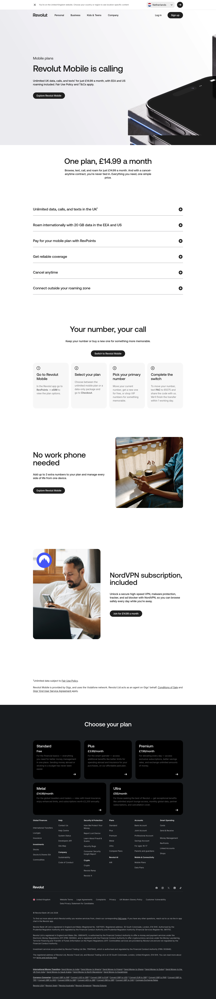

# Mobile Plans Product Page

**URL:** `/mobile-plans` (page title: "Mobile plans | Revolut United Kingdom") · **Occurrences:** 1 page in this run

Product page for Revolut Mobile, a SIM plan sold through the app. It covers the single £14.99 plan, how to switch or port a number, extra numbers for a second line, and a bundled NordVPN subscription.

## Section outline (top to bottom)

1. **[Site Header / Navigation](../components/site-header-navigation.md)**
2. **[Product Page Intro Banner](../components/product-page-intro-banner.md)**: "Revolut Mobile is calling", the £14.99 unlimited UK plan with EEA and US roaming.
3. **[Section Intro](../components/section-intro.md)**: "One plan, £14.99 a month", intro line ahead of the plan detail list.
4. **[FAQ Accordion](../components/faq-accordion.md)**: accordion covering data limits, EEA/US roaming, paying with RevPoints, coverage, and cancellation.
5. **[Feature List with Link](../components/feature-list-with-link.md)**: "Your number, your call", the four-step switch process from choosing a plan to porting a number.
6. **[Feature Promo Block](../components/feature-promo-block.md)**: "No work phone needed", adding up to 3 extra numbers to one device.
7. **[Feature Promo Block](../components/feature-promo-block.md)**: "NordVPN subscription, included", the bundled VPN and ad blocker.
8. **[Disclaimer Block with Linked Terms](../components/disclaimer-block-with-linked-terms.md)**: footnotes on the Fair Use Policy and Revolut's role as an agent for Gigs and Vodafone.
9. **[Site Footer](../components/site-footer.md)**

## Content pattern

The page follows a single-product playbook: one hero, one price, a detail list, then a short sequence of feature call-outs (switching, extra numbers, VPN) before the legal footnotes. Unlike the investment pages in this batch, the risk language here is limited to a Fair Use Policy footnote rather than a full disclaimer block, since a mobile plan isn't a regulated financial product.
