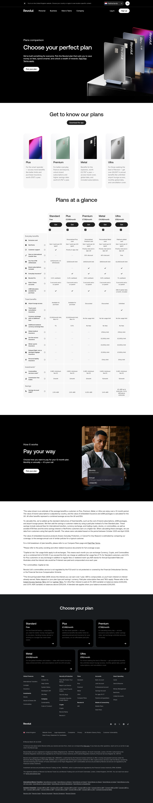

# Compare Plans Page

**URL:** `/our-pricing-plans` (page title: "Compare Revolut Plans | Revolut United Kingdom") · **Occurrences:** 1 page in this run

The central plan-comparison page that all the individual plan pages (Plus, Premium, and others) link out to. It summarizes each paid tier, gives a full feature comparison, and explains monthly versus annual billing.

## Section outline (top to bottom)

1. **[Site Header / Navigation](../components/site-header-navigation.md)**
2. **[Product Page Intro Banner](../components/product-page-intro-banner.md)**: "Choose your perfect plan", "Plans comparison".
3. **[Plan Comparison Table](../components/plan-comparison-table.md)**: "Get to know our plans", cards for Plus, Premium, Metal, and Ultra.
4. **[Feature Promo Block](../components/feature-promo-block.md)**: "Pay your way", monthly versus annual billing for the 12-month plan.
5. **[Disclaimer Block with Linked Terms](../components/disclaimer-block-with-linked-terms.md)**
6. **[Site Footer](../components/site-footer.md)**

## Content pattern

This page works as a hub: a short intro, a card-level summary of each plan, a billing explainer, and a footnote block, all built to be quick to scan since visitors have usually already read about a specific plan elsewhere.

## Variants observed

The screenshot shows a large "Plans at a glance" comparison table (row-by-row features like Exclusive card, RevPoints, ATM withdrawals, travel insurance, and investment fees, across all five plan columns) between the plan cards and the "Pay your way" section. This table is a distinct, prominent part of the page but has no corresponding block in the outline data, the outline jumps directly from "Plan Overview Cards" to "Billing Frequency Feature".
