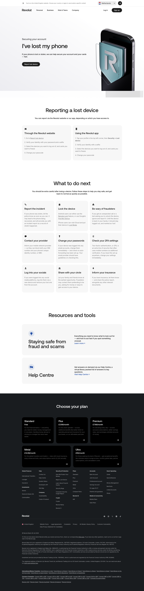

# Report Lost Device

**URL:** `/report-lost-device` (page title: "Report Lost Device | Revolut United Kingdom") · **Occurrences:** 1 page in this run

A support page for a user whose phone is lost or stolen. It gives step-by-step instructions for reporting the device, a checklist of follow-up actions, and links to related help resources, before the plan comparison footer.

## Section outline (top to bottom)

1. **[Site Header / Navigation](../components/site-header-navigation.md)**
2. **[Feature Promo Block](../components/feature-promo-block.md)**: "I've lost my phone", with a "Report lost device" button.
3. **[Feature List with Link](../components/feature-list-with-link.md)**: "Reporting a lost device", two cards for reporting through the website or the app.
4. **[FAQ Accordion](../components/faq-accordion.md)**: "What to do next", nine follow-up steps (report the incident, lock the device, contact your provider, and others).
5. **[Feature List with Link](../components/feature-list-with-link.md)**: "Resources and tools", linking to "Staying safe from fraud and scams" and the Help Centre.
6. **[Site Footer](../components/site-footer.md)**

## Content pattern

This is a support/help template rather than a sales page: no pricing or savings-rate pitch, just an instructional flow that goes from filing the report to a follow-up checklist, closing with links out to more help content. The opening block is classified as a Feature Promo Block here, though visually it functions as this page's hero (full-width intro with heading, body copy, and a single call to action next to a supporting image).
