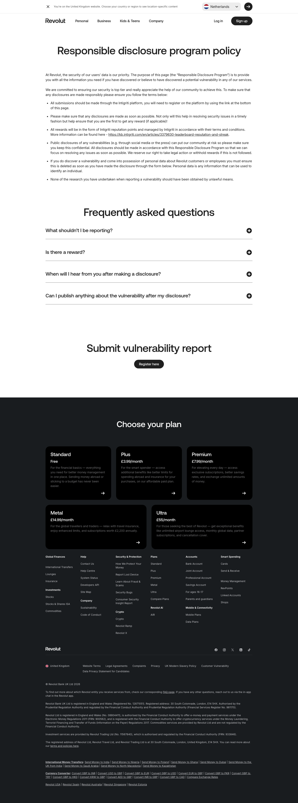

# Responsible Disclosure Program Page

**URL:** `/responsible-disclosure-program` (page title: "Responsible Disclosure Program Policy | Revolut United Kingdom") · **Occurrences:** 1 page in this run

Legal and security policy page for reporting vulnerabilities. Plain text over a white background: policy rules, an FAQ accordion, and a link to the reporting platform.

## Section outline (top to bottom)

1. **[Site Header / Navigation](../components/site-header-navigation.md)**
2. **[Section Intro](../components/section-intro.md)**: "Responsible disclosure program policy" page heading, no supporting text.
3. **[Trust Indicator & Disclaimer Strip](../components/trust-indicator-disclaimer-strip.md)**: intro paragraph on the purpose of the program.
4. **[Disclaimer Block with Linked Terms](../components/disclaimer-block-with-linked-terms.md)**: bullet list of submission rules, including a link to Intigriti's reputation and streak article.
5. **[Feature List with Link](../components/feature-list-with-link.md)**: "Frequently asked questions" accordion, "What shouldn't I be reporting?", "Is there a reward?", "When will I hear from you after making a disclosure?", "Can I publish anything about the vulnerability after my disclosure?"
6. **[Centered Heading CTA Banner](../components/centered-heading-cta-banner.md)**: "Submit vulnerability report" with a "Register here" button.
7. **[Site Footer](../components/site-footer.md)**

## Content pattern

A pure reference document dressed in the site's standard components: heading, disclaimer paragraphs, a rules list, an FAQ, and a single CTA to the external reporting platform. There's no marketing content on the page at all, it reads like a policy document rendered in the house style.
