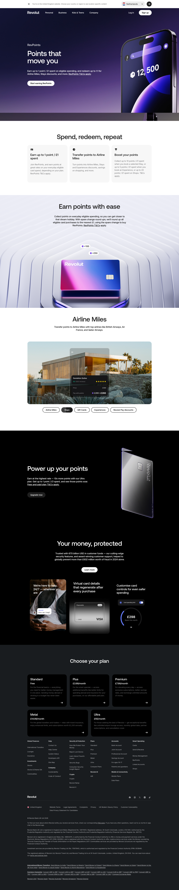

# RevPoints Program Page

**URL:** `/rev-points` (page title: "RevPoints | Revolut United Kingdom") · **Occurrences:** 1 page in this run

Product page for RevPoints, Revolut's loyalty program. It explains how points are earned on card spend and redeemed for airline miles, hotel stays, and other rewards, then upsells the paid plans that earn points faster.

## Section outline (top to bottom)

1. **[Site Header / Navigation](../components/site-header-navigation.md)**
2. **[Product Page Intro Banner](../components/product-page-intro-banner.md)**: "Points that move you" hero with a phone showing a live points balance.
3. **[Text Feature List](../components/text-feature-list.md)**: three-column strip under "Spend, redeem, repeat", covering earn rate, airline transfers, and booking boosts.
4. **[Feature Promo Block](../components/feature-promo-block.md)**: "Earn points with ease", explaining spare change roundups toward points.
5. **[Option List Panel](../components/option-list-panel.md)**: "Airline Miles" shown by default, alongside Stays, Gift Cards, Experiences, and Revolut Pay discounts.
6. **[Product Page Intro Banner](../components/product-page-intro-banner.md)**: repeats mid-page as "Power up your points", pitching the Ultra plan's higher earn rate.
7. **[Feature Card Row](../components/feature-card-row.md)**: "Your money, protected", with 24/7 support, virtual card refresh, and spending control callouts.
8. **[Site Footer](../components/site-footer.md)**

## Content pattern

The page opens with the RevPoints pitch and mechanics, then moves through redemption options before pivoting to plan comparison and a generic trust section reused from other product pages. The trust and footer blocks are shared boilerplate; only the top five sections are specific to RevPoints.
