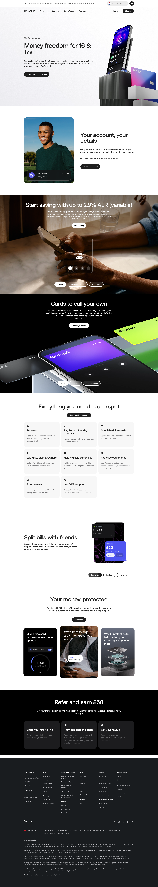

# Revolut for Ages 16-17

**URL:** `/revolut-for-ages-16-17` (page title: "A Revolut account for 16-17 year olds") · **Occurrences:** 1 page in this run

A product page pitching a Revolut account built for 16 and 17 year olds. It leads with independence from a parent's permission, then works through the account features, savings rate, everyday spending tools, security, and a referral offer.

## Section outline (top to bottom)

1. **[Site Header / Navigation](../components/site-header-navigation.md)**
2. **[Product Page Intro Banner](../components/product-page-intro-banner.md)**: "Money freedom for 16 & 17s", pitching an account with no parent permission needed.
3. **[Feature Promo Block](../components/feature-promo-block.md)**: "Your account, your details", own account number and sort code.
4. **[Full-Bleed Centered Promo Panel](../components/full-bleed-centered-promo-panel.md)**: "Start saving with up to 2.9% AER (variable)".
5. **[Feature List with Link](../components/feature-list-with-link.md)**: "Everything you need in one spot", covering transfers, paying friends, and card spending.
6. **[App Screenshot Feature Block](../components/app-screenshot-feature-block.md)**: "Split bills with friends".
7. **[Feature Card Row](../components/feature-card-row.md)**: "Your money, protected", citing "67.5 billion USD in customer deposits".
8. **[Feature List with Link](../components/feature-list-with-link.md)**: "Refer and earn £50".
9. **[Site Footer](../components/site-footer.md)**

## Content pattern

This is a standard age-gated product pitch: hero establishes the target audience and core promise (independence), then a run of feature blocks builds out the account's capabilities one at a time, closing with a trust section and a referral incentive before the footer. The screenshot shows one additional dark section ("Cards to call your own", virtual and special-edition cards) between the savings banner and the feature card grid that isn't represented in the outline data for this template.

## Variants observed

The outline data skips a section visible in the screenshot: a dark "Cards to call your own" panel sits between the savings banner (block 4) and the feature card grid (block 5). It wasn't captured as its own outline block, so it isn't listed above.
