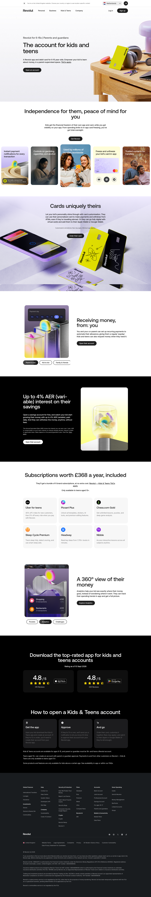

# Revolut for Kids and Teens, Parents and Guardians

**URL:** `/revolut-kids-and-teens-parent-and-guardians` (page title: "Revolut 6-15 | Parents & Guardians") · **Occurrences:** 1 page in this run

A product page for the Revolut account aimed at 6-15 year olds, written for the parent or guardian who sets it up. It's the longest page in this batch, covering parental controls, card customisation, allowance payments, savings interest, bundled subscriptions, money tracking, and app ratings before the footer.

## Section outline (top to bottom)

1. **[Site Header / Navigation](../components/site-header-navigation.md)**
2. **[Product Page Intro Banner](../components/product-page-intro-banner.md)**: "The account for kids and teens", pitched at "Parents and guardians".
3. **[Feature Card Row](../components/feature-card-row.md)**: "Independence for them, peace of mind for you", covering spending limits and card freezing.
4. **[Feature Promo Block](../components/feature-promo-block.md)**: "Cards uniquely theirs", on card customisation.
5. **[Photo Feature Block](../components/photo-feature-block.md)**: "Receiving money, from: you", on setting up recurring allowance payments.
6. **[Product Page Intro Banner](../components/product-page-intro-banner.md)**: "Up to 4% AER (variable) interest on their savings".
7. **[FAQ Accordion](../components/faq-accordion.md)**: "Subscriptions worth £368 a year, included", listing six bundled brand subscriptions.
8. **[Photo Feature Block](../components/photo-feature-block.md)**: heading given as "Money, organised", on organising money with Pockets.
9. **[Alternating Image and Copy Sequence](../components/alternating-image-and-copy-sequence.md)**: "Download the top-rated app for kids and teens accounts", with a "4.8 / 5" rating and setup steps.
10. **[Site Footer](../components/site-footer.md)**

## Content pattern

The page builds a case for parents in stages: control and safety first (limits, freezing, customisation), then the money mechanics (allowance, savings, subscriptions, tracking), then social proof and setup steps. It's the only template in this batch that closes with an app-rating and getting-started block before the footer rather than going straight from the last feature section to it.

## Variants observed

Outline block 8's heading is given as "Money, organised", but the screenshot shows this position in the page as "A 360° view of their money" with "Pockets", "Analytics", and "Challenges" buttons underneath. The button labels line up with the block's textSnippet (which mentions Pockets), so the block is in the right place, but the heading text captured for it doesn't match what's currently on the live page at that spot.
