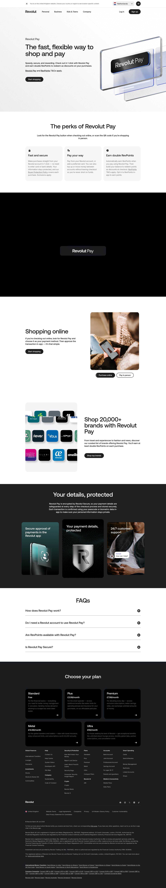

# Revolut Pay Product Page

**URL:** `/revolut-pay` (page title: "Revolut Pay") · **Occurrences:** 1 page in this run

The product page for Revolut Pay, the one-click checkout payment method. It pitches the feature to shoppers with a hero, a perks grid, a video demo, and a merchant list, then closes on security and an FAQ.

## Section outline (top to bottom)

1. **[Site Header / Navigation](../components/site-header-navigation.md)**
2. **[Product Page Intro Banner](../components/product-page-intro-banner.md)**: "The fast, flexible way to shop and pay", pitching 1-click checkout and double RevPoints.
3. **[Feature List with Link](../components/feature-list-with-link.md)**: "The perks of Revolut Pay", covering "Fast and secure", "Pay your way", and "Earn double RevPoints".
4. **[Full-Bleed Statement Banner](../components/full-bleed-statement-banner.md)**: "Pay in 1 click, it's that easy", a looping video of the checkout flow.
5. **[Two-Column Content Feature Block](../components/two-column-content-feature-block.md)**: "Shopping online", walking through choosing Revolut Pay at checkout and approving the transaction in the app.
6. **[Product Page Intro Banner](../components/product-page-intro-banner.md)**: "Shop 20,000+ brands with Revolut Pay", repeating mid-page to promote the merchant catalog.
7. **[Feature Highlight Card Row](../components/feature-highlight-card-row.md)**: "Your details, protected", on Revolut Secure encryption during checkout.
8. **[Feature List with Link](../components/feature-list-with-link.md)**: "FAQs", rendered as an expandable question list, e.g. "How does Revolut Pay work?".
9. **[Site Footer](../components/site-footer.md)**

## Content pattern

The page sells one feature from multiple angles rather than covering a full product line. It opens with the core pitch, backs it up with a perks grid and a video demo, then widens into merchant coverage and security before an FAQ answers the leftover questions. The hero component repeats mid-page to introduce the merchant list, a role it doesn't play on most other pages, where it only opens the page.
