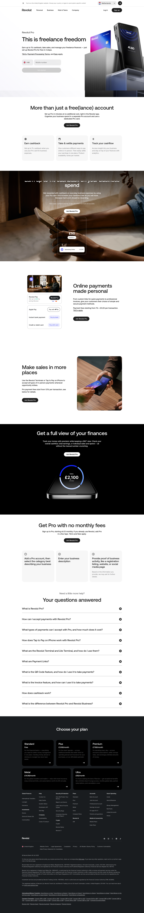

# Revolut Pro Product Page

**URL:** `/revolut-pro` (page title: "Revolut Pro | Earn Cashback, Make Payments | Revolut United Kingdom") · **Occurrences:** 1 page in this run

The product page for Revolut Pro, the freelance and sole-trader account. It runs hero, benefit list, and payment feature sections, then a signup walkthrough and FAQ before the shared footer.

## Section outline (top to bottom)

1. **[Site Header / Navigation](../components/site-header-navigation.md)**
2. **[Product Signup Hero](../components/product-signup-hero.md)**: "This is freelance freedom", eyebrow "Revolut Pro", with a phone number signup field.
3. **[Centered Heading CTA Banner](../components/centered-heading-cta-banner.md)**: "More than just a free(lance) account".
4. **[Text Feature List](../components/text-feature-list.md)**: "Earn cashback" and "Take & settle payments" listed as separate benefits.
5. **[Feature Promo Block](../components/feature-promo-block.md)**: "Earn up to 1% cashback on your business spend".
6. **[Feature Promo Block](../components/feature-promo-block.md)**: "Online payments made personal", on custom payment links and invoices.
7. **[Feature Promo Block](../components/feature-promo-block.md)**: "Make sales in more places", on Revolut Terminals and Tap to Pay on iPhone.
8. **[Feature Promo Block](../components/feature-promo-block.md)**: "Get a full view of your finances", on cashflow and earnings tracking.
9. **[Centered Heading CTA Banner](../components/centered-heading-cta-banner.md)**: "Get Pro with no monthly fees".
10. **[Text Feature List](../components/text-feature-list.md)**: three-step signup flow starting with "Add a Pro account, then select the category best describing your business".
11. **[FAQ Accordion](../components/faq-accordion.md)**: "Your questions answered", covering nine questions including "What is Revolut Pro?" and "How does cashback work?".
12. **[Site Footer](../components/site-footer.md)**

## Content pattern

This page uses two separate single-link CTA banners partway through the scroll, one after the opening benefit list and one just before the signup steps, rather than repeating one CTA at the top and bottom. Combined with the FAQ accordion at the end, it reads as more conversion-focused than the other account pages, aimed at pushing a freelancer through signup rather than just explaining the product.
