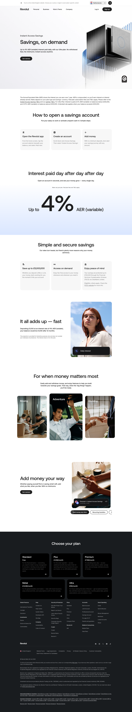

# Savings Account Page

**URL:** `/savings` (page title: "Turn Idle Cash Into Interest | Start Saving Online | Revolut United Kingdom") · **Occurrences:** 1 page in this run

The product page for Revolut's Instant Access Savings account. It leads with the interest rate, walks through account setup, then repeats the rate and security pitch through several feature sections.

## Section outline (top to bottom)

1. **[Site Header / Navigation](../components/site-header-navigation.md)**
2. **[Product Page Intro Banner](../components/product-page-intro-banner.md)**: "Savings, on demand", eyebrow "Instant Access Savings".
3. **[Disclaimer Block with Linked Terms](../components/disclaimer-block-with-linked-terms.md)**: AER definition and rate tiers by plan.
4. **[Section Intro](../components/section-intro.md)**: "How to open a savings account".
5. **[Text Feature List](../components/text-feature-list.md)**: three-step walkthrough starting with "Open the Revolut app".
6. **[Image & Caption Block](../components/image-caption-block.md)**: "Interest paid day after day after day", showing "Up to 4% AER (variable)".
7. **[Section Intro](../components/section-intro.md)**: "Simple and secure savings".
8. **[Feature List with Link](../components/feature-list-with-link.md)**: "Save up to £5,000,000", on deposit limits and fee-free access.
9. **[Image & Caption Block](../components/image-caption-block.md)**: a worked example showing a £1,000 deposit at 4% AER (variable) reaching a £1,040 balance after 12 months.
10. **[Feature Highlight Card Row](../components/feature-highlight-card-row.md)**: "For when money matters most", with goal photos labelled "Moving", "Adventure", and "Wedding".
11. **[Two-Column Content Feature Block](../components/two-column-content-feature-block.md)**: "Add money your way", on recurring transfers and no minimum deposits.
12. **[Site Footer](../components/site-footer.md)**

## Content pattern

The page states the headline rate three times (hero, illustrated statement block, and again in the feature detail card) before moving into softer, goal-based content near the end. It follows the same hero-then-proof-then-feature rhythm as Bank Account, but stays narrower in scope since it covers one account type rather than a full banking product.
