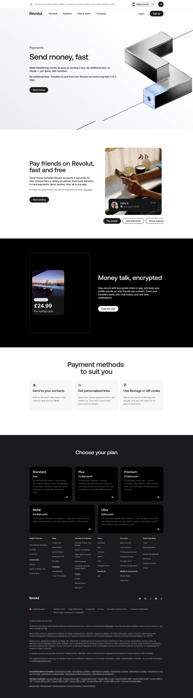

# Payments (Send and Receive)

**URL:** `/send-and-receive` (page title: "Payments | Revolut United Kingdom") · **Occurrences:** 1 page in this run

A product page for Revolut's peer-to-peer payments feature. It moves from the core pitch (fast, free transfers) through the in-app chat and payment-method options, then into the plan comparison footer.

## Section outline (top to bottom)

1. **[Site Header / Navigation](../components/site-header-navigation.md)**
2. **[Product Page Intro Banner](../components/product-page-intro-banner.md)**: "Send money, fast", with the line "No additional fees, no hassle, just quick, safe transfers."
3. **[Photo Feature Block](../components/photo-feature-block.md)**: "Pay friends on Revolut, fast and free".
4. **[Product Page Intro Banner](../components/product-page-intro-banner.md)**: "Money talk, encrypted", on encrypted in-app chat.
5. **[Text Feature List](../components/text-feature-list.md)**: "Payment methods to suit you", covering contacts, personalised links, and Revtags/QR codes.
6. **[Site Footer](../components/site-footer.md)**

## Content pattern

A short, focused product page: one hero, two supporting feature sections that alternate light and dark backgrounds, a three-card summary of payment methods, then straight to the footer. There's no trust/security block or referral offer here, unlike the longer account pages in this batch.
