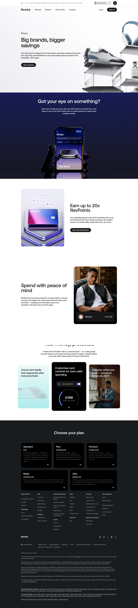

# Shops Page

**URL:** `/shops` (page title: "Shops | Revolut United Kingdom") · **Occurrences:** 1 page in this run

The product page for Revolut's in-app shopping and cashback marketplace. It pitches the brand catalog and RevPoints rewards, then closes on purchase protection and the standard security proof section.

## Section outline (top to bottom)

1. **[Site Header / Navigation](../components/site-header-navigation.md)**
2. **[Product Page Intro Banner](../components/product-page-intro-banner.md)**: "Big brands, bigger savings"
3. **[Image & Caption Block](../components/image-caption-block.md)**: "Got your eye on something?", pitching over 900 partner brands next to a phone screenshot of the Shops tab.
4. **[Feature Promo Block](../components/feature-promo-block.md)**: "Earn up to 20x RevPoints" on purchases made through Shops.
5. **[Image & Caption Block](../components/image-caption-block.md)**: "Spend with peace of mind", on purchase protection and single-use virtual cards.
6. **[Feature Highlight Card Row](../components/feature-highlight-card-row.md)**: "Your money, protected", citing 67.5 billion USD in customer funds.
7. **[Site Footer](../components/site-footer.md)**

## Content pattern

A short product page that leans on a single illustrated section, an app screenshot showing live deals, rather than a video or a repeated hero, before moving through rewards, purchase protection, and the same security proof section used on other product pages.
