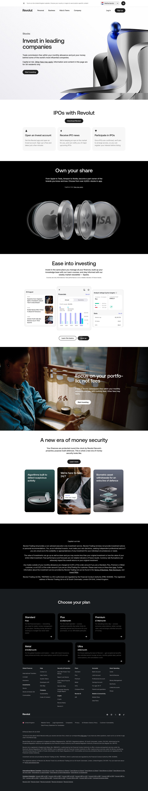

# Stock Trading Product Page

**URL:** `/stock-trading` (page title: "Investing for Beginners | How to Start Investing in Stocks | Revolut United Kingdom") · **Occurrences:** 1 page in this run

Product page for Revolut's stock trading feature. It walks through commission-free trading, IPO access, in-app research tools, and fees, then closes with a regulatory risk disclaimer.

## Section outline (top to bottom)

1. **[Site Header / Navigation](../components/site-header-navigation.md)**
2. **[Product Page Intro Banner](../components/product-page-intro-banner.md)**: "Invest in leading companies", the stock trading pitch and monthly commission-free allowance.
3. **[Feature List with Link](../components/feature-list-with-link.md)**: "IPOs with Revolut", three steps covering opening an account, IPO alerts, and participating.
4. **[Product Page Intro Banner](../components/product-page-intro-banner.md)**: "Own your share", rotating brand logos (Apple, Tesla, Amazon, Nvidia) over 4,000+ available stocks.
5. **[App Screenshot Feature Block](../components/app-screenshot-feature-block.md)**: "Ease into investing", app screenshots for news, financials, and analyst ratings.
6. **[Feature Promo Block](../components/feature-promo-block.md)**: "Focus on your portfolio, not fees", commission-free trading and zero custody fees.
7. **[Feature Card Row](../components/feature-card-row.md)**: "A new era of money security", three cards on fraud detection, support, and biometric withdrawals.
8. **[Disclaimer Block with Linked Terms](../components/disclaimer-block-with-linked-terms.md)**: "Capital is at risk", regulatory text on Revolut Trading Ltd's non-advised service.
9. **[Site Footer](../components/site-footer.md)**

## Content pattern

The page builds a case for investing (leading brands, ease of use, security) before the plan comparison footer, then closes the main content with a mandatory risk disclaimer ahead of that footer. The disclaimer block is specific to regulated investment products and doesn't appear on non-investment pages like RevPoints.
