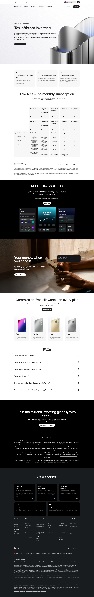

# Stocks and Shares ISA Product Page

**URL:** `/stocks-and-shares-isa` (page title: "Stocks and Shares ISA") · **Occurrences:** 1 page in this run

Product page for Revolut's Stocks and Shares ISA. It covers the tax-free allowance, how to open an account, a fee comparison against competitors, and the plan tiers that unlock more commission-free trades, then ends with an FAQ list.

## Section outline (top to bottom)

1. **[Site Header / Navigation](../components/site-header-navigation.md)**
2. **[Product Page Intro Banner](../components/product-page-intro-banner.md)**: "Tax-efficient investing", the £20,000 annual allowance pitch.
3. **[Text Feature List](../components/text-feature-list.md)**: "Open a Stocks & Shares ISA", three steps: choose investments, fund the account, manage flexibly.
4. **[Section Intro](../components/section-intro.md)**: "Low fees & no monthly subscription", intro line ahead of the comparison table.
5. **[Plan and Provider Comparison Table](../components/plan-and-provider-comparison-table.md)**: Revolut fees against Hargreaves Lansdown, interactive investor, Freetrade, and Vanguard.
6. **[Trust Indicator & Disclaimer Strip](../components/trust-indicator-disclaimer-strip.md)**: "Important information", notes on how the comparison table was compiled.
7. **[Photo Feature Block](../components/photo-feature-block.md)**: "4,000+ Stocks & ETFs", in-app trade, analytics, and portfolio screens.
8. **[Centered Heading CTA Banner](../components/centered-heading-cta-banner.md)**: "Commission-free allowance on every plan", linking to the plan comparison.
9. **[Option List Panel](../components/option-list-panel.md)**: Plus, Premium, Metal, and Ultra cards with their commission-free order counts.
10. **[FAQ Accordion](../components/faq-accordion.md)**: "FAQs", questions like "What is a Stocks & Shares ISA?" and "What are the Stocks & Shares ISA fees?".
11. **[Centered Heading CTA Banner](../components/centered-heading-cta-banner.md)**: "Join the millions investing globally with Revolut", closing sign-up prompt with capital-at-risk notice.
12. **[Site Footer](../components/site-footer.md)**

## Content pattern

This page mixes a regulated-product sales pitch with reference material: a fee comparison table, a legal caveat on that table, and an FAQ list. It's longer and more heavily disclaimed than the other investment pages in this batch because an ISA carries tax-specific rules the copy has to explain.
