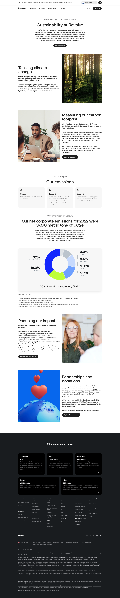

# Sustainability Page

**URL:** `/sustainability` (page title: "Sustainability | Revolut United Kingdom") · **Occurrences:** 1 page in this run

Corporate responsibility page laying out Revolut's environmental commitments, with a carbon footprint breakdown backed by a chart and specific 2022 figures, followed by initiatives and partnerships.

## Section outline (top to bottom)

1. **[Site Header / Navigation](../components/site-header-navigation.md)**
2. **[Centered Heading CTA Banner](../components/centered-heading-cta-banner.md)**: "Sustainability at Revolut" intro paragraph under a "Here's what we do to help the planet" eyebrow, with an "Explore careers" button.
3. **[Image & Caption Block](../components/image-caption-block.md)**: "Tackling climate change" text next to a forest photo.
4. **[Feature Promo Block](../components/feature-promo-block.md)**: "Measuring our carbon footprint" text next to an office photo, with a "Discover Watershed" link.
5. **[Text Feature List](../components/text-feature-list.md)**: "Our emissions" three cards for Scope 1, Scope 2, and Scope 3 emissions.
6. **[Section Intro](../components/section-intro.md)**: "Our net corporate emissions for 2022 were 37,170 metric tons of CO2e" heading under a "Carbon footprint breakdown" eyebrow.
7. **[Feature Promo Block](../components/feature-promo-block.md)**: "CO2e footprint by category (2022)" donut chart showing Goods & Services at 37%, Other at 19.3%, Cloud at 16.1%, Employees at 13.8%, Products at 9.5%, and Offices at 4.3%.
8. **[Trust Indicator & Disclaimer Strip](../components/trust-indicator-disclaimer-strip.md)**: chart category definitions.
9. **[Feature Promo Block](../components/feature-promo-block.md)**: "Reducing our impact" text next to an office photo, with a "Learn about Cycle to Work" link.
10. **[Feature Promo Block](../components/feature-promo-block.md)**: "Partnerships and donations" text next to an illustration, with an "Explore Revolut careers" link.
11. **[Site Footer](../components/site-footer.md)**

## Content pattern

The page moves from broad commitment to specific numbers to action: a general mission statement, then two topic cards (climate, measurement), then a hard data section with a chart and disclaimer, then two closing cards on what the company is actually doing about it. The repeated "Content Highlight Block" instances carry most of the page's argument.
