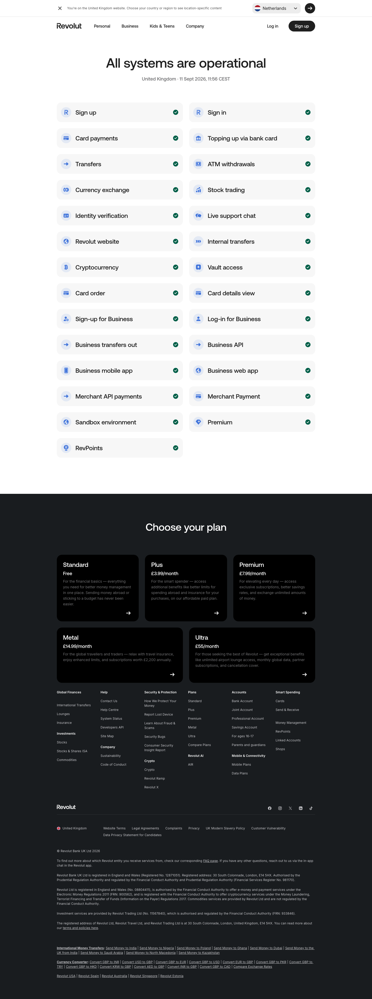

# System Status Page

**URL:** `/system-status` (page title: "System status | Revolut United Kingdom") · **Occurrences:** 1 page in this run

Live status page for Revolut's services. A single "All systems are operational" heading sits above a grid of service checks, each with a green checkmark, timestamped for the visitor's region.

## Section outline (top to bottom)

1. **[Site Header / Navigation](../components/site-header-navigation.md)**
2. **[Heading-Led Content Block](../components/heading-led-content-block.md)**: "All systems are operational" with a "United Kingdom · 11 Sept 2026, 11:56 CEST" timestamp, then a two-column grid of 26 services (Sign up, Card payments, Transfers, Currency exchange, Stock trading, Business API, RevPoints, and more), each marked operational.
3. **[Site Footer](../components/site-footer.md)**

## Content pattern

This is the simplest template in the batch: no marketing copy, no CTA, just a status readout between the standard header and footer. It exists purely as a reference page for support and trust purposes.
