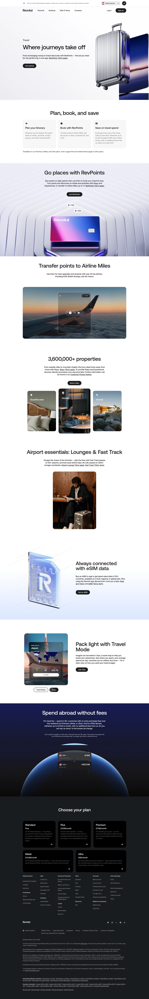

# Travel Page

**URL:** `/travel` (page title: "Travel | Revolut United Kingdom") · **Occurrences:** 1 page in this run

A feature overview page for Revolut's travel-related tools: RevPoints, Stays, airport lounges, eSIM data, and fee-free spending abroad. It reads as a catalogue of travel perks rather than a single product pitch.

## Section outline (top to bottom)

1. **[Site Header / Navigation](../components/site-header-navigation.md)**
2. **[Product Page Intro Banner](../components/product-page-intro-banner.md)**: "Where journeys take off".
3. **[Section Intro](../components/section-intro.md)**: "Plan, book, and save", three steps (plan itinerary, book with RevPoints, save on travel spend).
4. **[Trust Indicator & Disclaimer Strip](../components/trust-indicator-disclaimer-strip.md)**: plan and fee restrictions on weekend spending.
5. **[Feature Promo Block](../components/feature-promo-block.md)**: "Go places with RevPoints".
6. **[Image & Caption Block](../components/image-caption-block.md)**: "Transfer points to Airline Miles", "over 30 top airlines".
7. **[Feature Card Row](../components/feature-card-row.md)**: "3,600,000+ properties" via Stays.
8. **[Feature Promo Block](../components/feature-promo-block.md)**: "Airport essentials: Lounges & Fast Track".
9. **[Feature Promo Block](../components/feature-promo-block.md)**: "Always connected with eSIM data", "100+ countries".
10. **[Two-Column Content Feature Block](../components/two-column-content-feature-block.md)**: "Pack light with Travel Mode".
11. **[Image & Caption Block](../components/image-caption-block.md)**: "Spend abroad without fees".
12. **[Site Footer](../components/site-footer.md)**

## Content pattern

This template is a benefits catalogue: each section introduces one distinct travel perk (points, lounges, eSIM, fee-free spend) with its own short pitch and CTA, rather than building a single narrative. It functions as a directory page pointing toward the specific products (Stays, RevPoints, Travel Mode) that deliver each perk.
